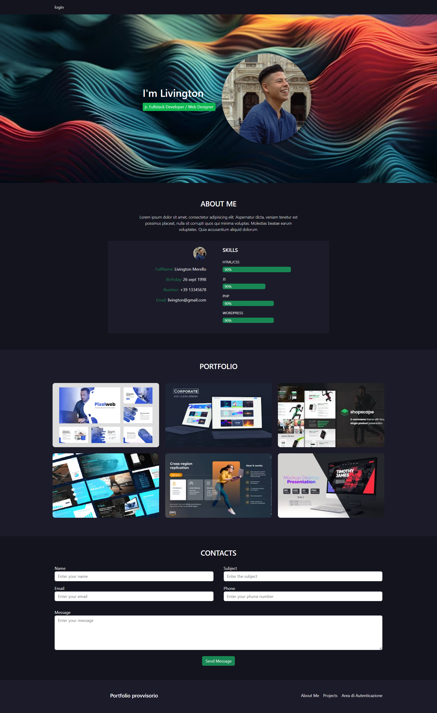
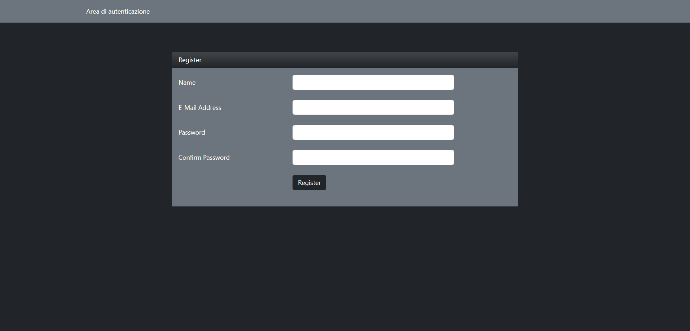
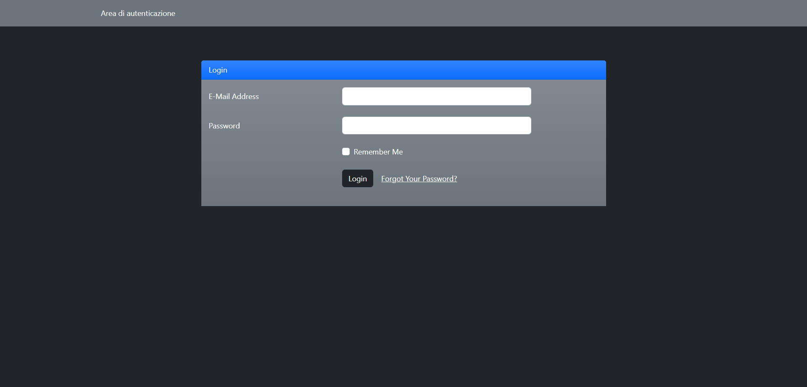
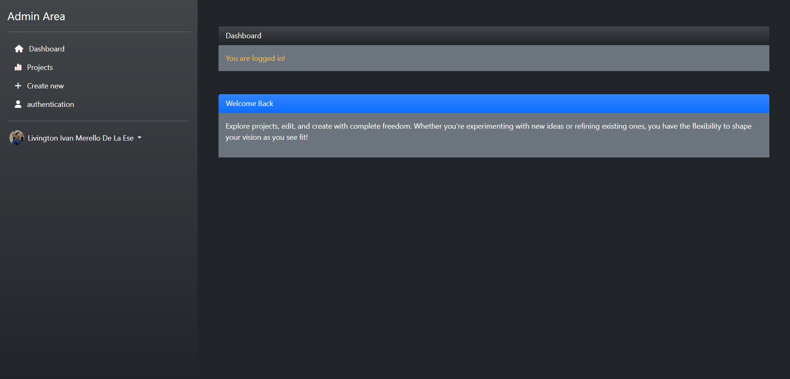
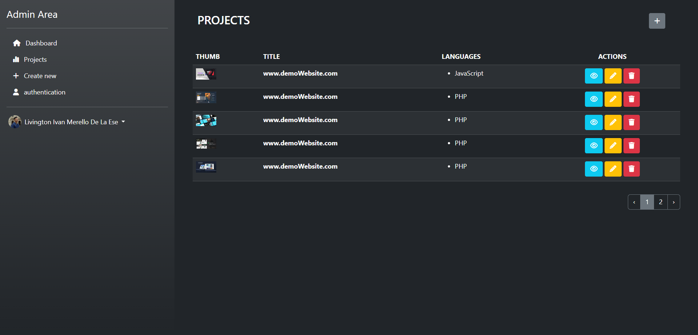
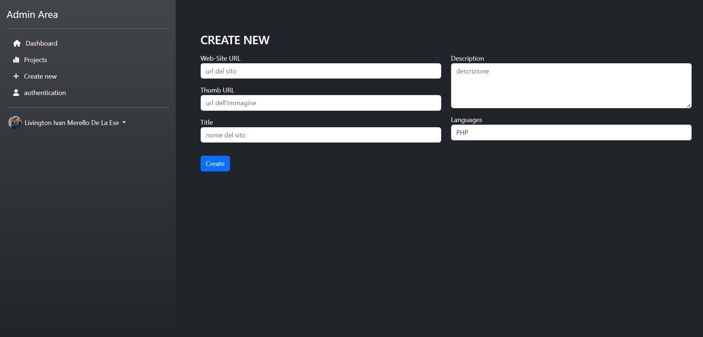
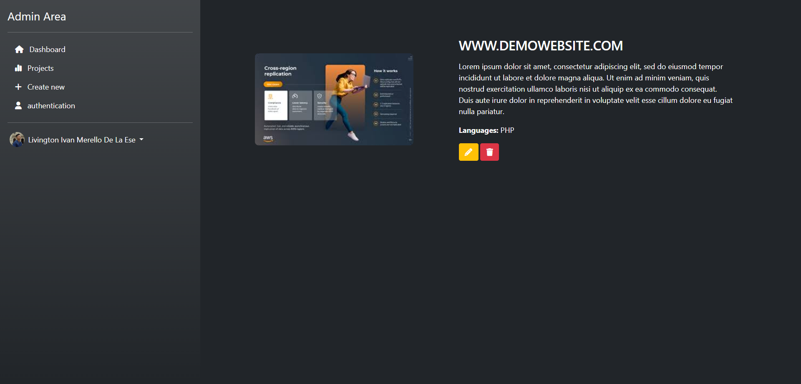
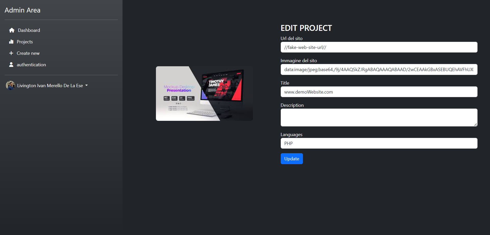

# Laravel Auth

Descrizione del Progetto: 

Laravel Auth è un progetto di gestione portfolio realizzato come esercizio accademico. Utilizza Laravel Breeze per l'autenticazione degli utenti e CRUD (Create, Read, Update, Delete) per la gestione dell'area di backoffice. L'applicazione consente di visualizzare, aggiungere, modificare e cancellare progetti attraverso un pannello di amministrazione costruito con Blade e Bootstrap. Include inoltre una pagina guest per la visualizzazione dei progetti senza possibilità di modifica a meno che l'utente non sia autenticato.

## Preview

# installazione progetto:

    git clone:https://github.com/LivingtonMerello98/laravel-auth.git
    cd laravel-auth

Installare le dipendenze:

    composer install
    npm install
    npm run dev

Configurare il file .env:

    cp .env.example .env
    php artisan key:generate

Configurare il database nel file .env:

    DB_CONNECTION=mysql
    DB_HOST=127.0.0.1
    DB_PORT=3306
    DB_DATABASE=nome_database
    DB_USERNAME=nome_utente
    DB_PASSWORD=password

Eseguire le migrazioni e i seeder:

    php artisan migrate
    php artisan db:seed
    
Installare Breeze:

    php artisan breeze:install
    npm install && npm run dev
    php artisan migrate

# Struttura:

Autenticazione:

•Registrazione, login e reset password sono gestiti tramite Breeze.

Gestione dei Progetti:

•Crea Progetto: Accessibile dall'area di amministrazione.

•Visualizza Progetti: Elenco dei progetti nella pagina di amministrazione e nella pagina guest.

•Modifica Progetto: Disponibile solo per utenti autenticati.

•Cancella Progetto: Disponibile solo per utenti autenticati.

•Area di Amministrazione:

Costruita con Blade e Bootstrap.
Accesso riservato agli utenti autenticati.
Esperienza Utente: Interfaccia user-friendly con navigazione intuitiva per gestire facilmente i progetti. Le azioni CRUD sono facilmente accessibili tramite pulsanti chiari e ben definiti.

•Pagina Guest:

Visualizzazione dei progetti senza possibilità di modifica.
Filtraggio dei dati del database.

•Esperienza Utente: Layout pulito e professionale che permette ai visitatori di esplorare il portfolio in modo chiaro e semplice. La pagina include immagini, titoli e descrizioni dei progetti.
Struttura del Database
Il database è stato strutturato con una tabella projects con le seguenti colonne:

 •id: ID del progetto

•url: URL del progetto

•image: Immagine del progetto

•title: Titolo del progetto

•description: Descrizione del progetto
## 🚀 About Me

•Nome: Livington Merello 

•Email: livington.merello@gmail.com

•GitHub: LivingtonMerello98
